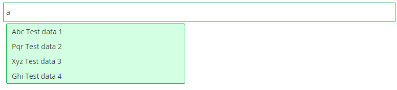
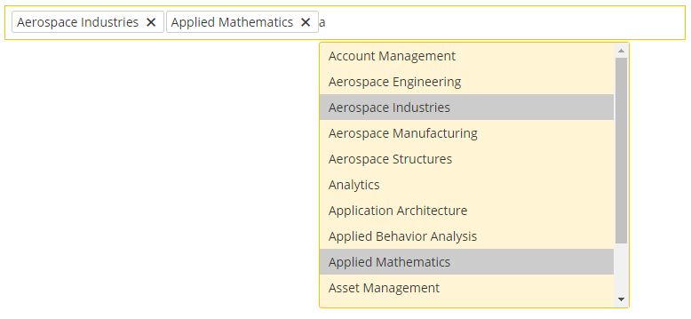

# TagText
This will stylizes your input that allows a you to type keywords, which will be broken up into tokens/tags.

###  Get a copy of the plugin
You can download the plugin from GitHub.

###  Load the required files
Inside the page's head tag include the desired CSS file.

In the page's footer, just before, include the required plugin files.

###  Create the HTML markup
`<input type="text" name="term" class="input-tag" />`

### Instantiate the Plugin
```
<script type="text/javascript">
    jQuery( document ).ready(function( $ ) { 
        $( '.input-tag' ).poper({
            /* available options */
        })
    }); 
</script>

```

### Example




### Demo
[Demo](https://gsrajpurohit.github.io/TagText/).

### Support
If you found a bug or have a feature suggestion, please email me on rajpurohitganpat@gmail.com.
If you need help with implementing the "Poper" in your project feel free to contact me on rajpurohitganpat@gmail.com.

License The plugin is available under the [MIT license](https://opensource.org/licenses/MIT).
